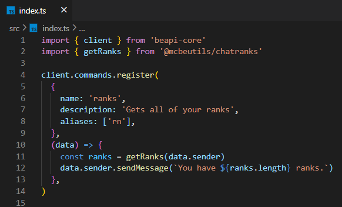

# ChatRanks

ChatRanks is a [BeAPI](https://github.com/MCBE-Utilities/BeAPI) module made for creating custom server ranks and abilities. ChatRanks is a very popular server plugin for both Java Edition and Bedrock Edition of Minecraft. This module allows you to create ChatRanks that will work on personal worlds and even bedrock realms

The module can be either imported as a Minecraft Bedrock Addon or be used within another BeAPI project.

## Installing as an Addon
* Requirements
  * [Minecraft Bedrock ^1.18.10.x](https://minecraft.net/)

To download and install, download the latest .mcpack release from [here](https://github.com/MCBE-Utilities/ChatRanks/releases/tag/1.0.0).
Once you have downloaded the addon, import the .mcpack into Minecraft Bedrock.
Then, create a new world, or add to existing, and make sure to enable Gametest Framework.
Finally, you now have ChatRanks installed on your Bedrock world.

To add and remove ranks in game, use the commands listed below.
```
tag @s add "rank:Member" // Adds a rank
tag @s remove "rank:Member" // Removes a rank
```
## Installing as a Dependency
* Requirements
  * [node.js](https://nodejs.org/)
  * [BeAPI](https://github.com/MCBE-Utilities/BeAPI)
  * [Minecraft Bedrock ^1.18.10.x](https://minecraft.net/)

To download and install, you can either git clone this repo and use the mcpe pack, or run the command below in your BeAPI project.
```npm install @mcbeutils/chatranks```
Once you have done that, you can now import "@mcbeutils/chatranks" into your main project.
